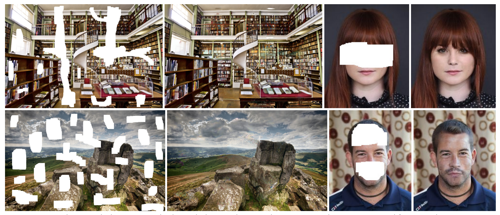
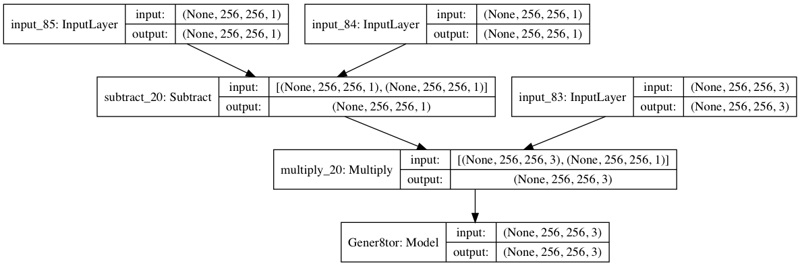
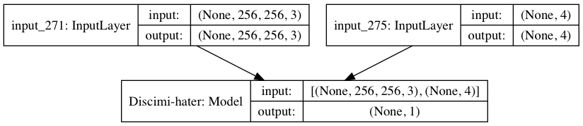
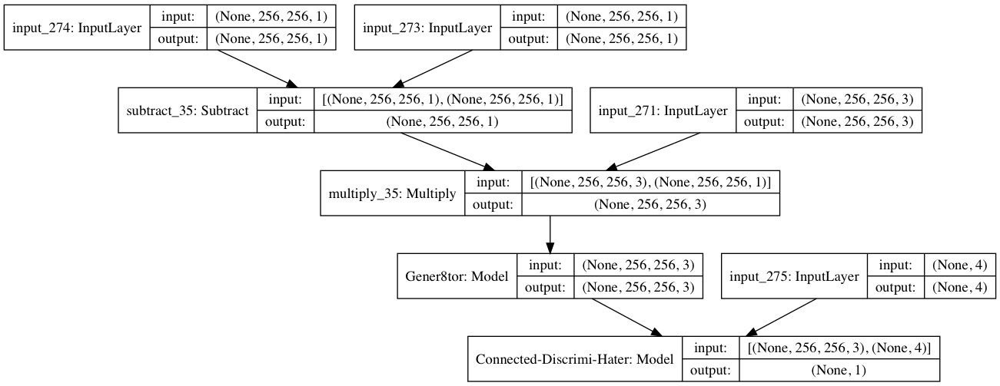
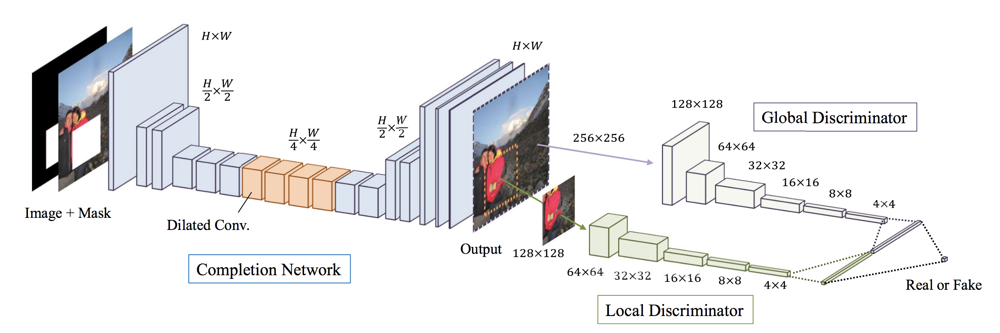

# Globally and Locally Consistent Image Completion

Kangzeroo's Keras 2.2.4 Implementation of the Paper ["Globally and Locally Consistent Image Completion"](http://hi.cs.waseda.ac.jp/%7Eiizuka/projects/completion/data/completion_sig2017.pdf). (Satoshi Iizuka et al, Waseda University, Japan)

## Local Env Setup
1. `conda env create --name MessyRoom`
2. `conda activate MessyRoom`
3. `pip install -r requirements.txt`

## Image Data Setup
1. Spin up GCloud VM and SSH into it
2. Use `lsun_script.sh` to setup VM and download dataset
3. Open `$ ipython notebook` to run through steps making the brain
4. Train network (est. 14 days on VM x1 GPU V80)

## Keras Implementation
  
Generator

  
Discriminator

  
Together

  

## Architecture

# TO DO

## 1. Healthy Model
1. Verify that `last_img[:,:,0]*255` is actually how to convert 0-1 back to 0-255 RGB (ask a Python guy)
2. Verify that our mis-organized gs://bucket/paths dont matter for wildcard `/**/*.png` image retrieval
3. Verify that we can actually hold all the img_urls from gs://bucket/train/* in python memory (should be ok since ML engine is serverless)
4. Verify that our model is fully convolutional like the paper
5. Look for potential pre-trained models online
6. Final audit that the model was made right
8. Retrieve and display the accuracy/percision metrics during training
        - refactor code to use model.fit_to_generator() to get History object with accuracy/percision metrics. find out where we define batch size and epochs etc

## 2. Building Tools
2. Save the accuracy & percision metrics to gs://bucket during training
2. Save last best checkpoint of model to gs://bucket. Also able to load model checkpoints to resume training (check if ML engine does that already - unlikely)
5. Setup the hyperparameter arguements injection for ML Engine

## 3. Training
1. Setup & Test single-GPU training on ML Engine
2. Setup & Test multi-GPU training on ML Engine
3. Train fully on ML Engine
